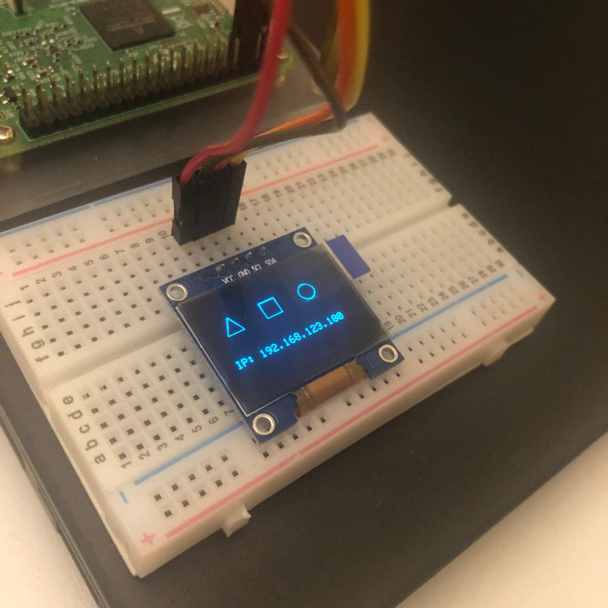
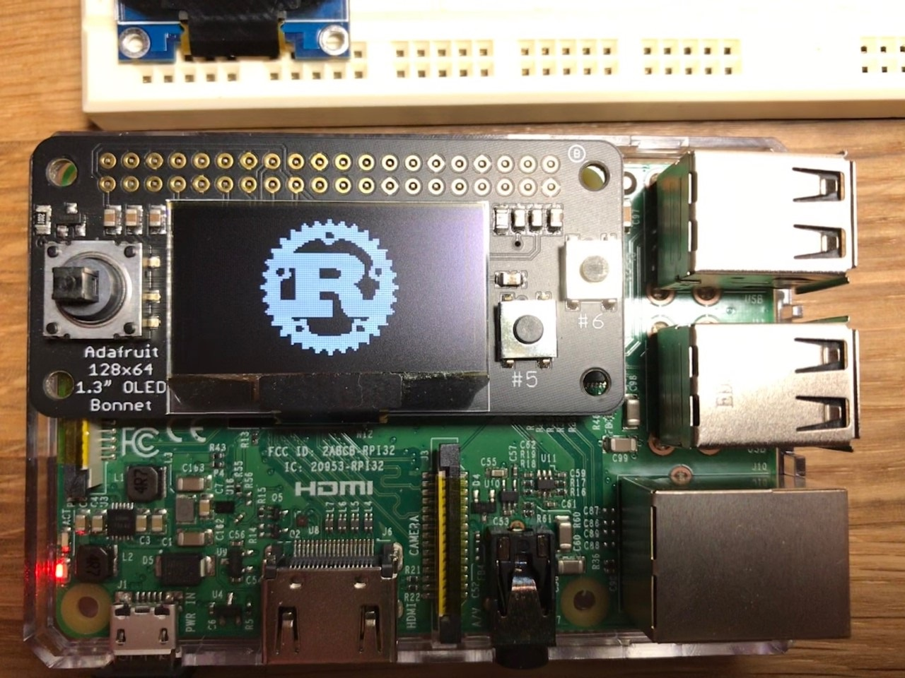

# SSD1306 demo on Raspberry pi

This is a sample that uses the built-in I2C bus available in Linux on the Raspberry Pi B/2/3/4. 

## Connections

This sample relies on the default [Raspberry Pi pinout](https://www.raspberrypi.org/documentation/usage/gpio/) for i2c:

| Pin |  Description                        |
|-----|-------------------------------------|
| 1   | 3.3 v power |
| 3   | GPIO 2 (SDA) |
| 5   | GPIO 3 (SCL) |
| 6   | ground |


Some boards such as the [Adafruit OLED bonnet](https://www.adafruit.com/product/3531) use this same pinout if you want something ready to use without extra wiring or soldering.

## OS Configuration

If you're using Raspbian - [raspi-config](https://www.raspberrypi.org/documentation/configuration/raspi-config.md) has an option to enable I2C by default. If you're using another distro - do a quick search and you will probably find a solution to enable it.

Before running this sample, you can check that your OLED display is detected by installing `i2c-tools` from your distro, then running `i2cdetect -y 1`. The first connected SSD1306 will usually be at address `0x3c`. This sample assumes `0x3c`. If your device is at a different address, then you may need to modify the code for it to work.

```
$ sudo i2cdetect -y 1
     0  1  2  3  4  5  6  7  8  9  a  b  c  d  e  f
00:          -- -- -- -- -- -- -- -- -- -- -- -- --
10: -- -- -- -- -- -- -- -- -- -- -- -- -- -- -- --
20: -- -- -- -- -- -- -- -- -- -- -- -- -- -- -- --
30: -- -- -- -- -- -- -- -- -- -- -- -- 3c -- -- --
40: -- -- -- -- -- -- -- -- -- -- -- -- -- -- -- --
50: -- -- -- -- -- -- -- -- -- -- -- -- -- -- -- --
60: -- -- -- -- -- -- -- -- -- -- -- -- -- -- -- --
70: -- -- -- -- -- -- -- --
```

## Building the code

The easiest way to build this sample is with [Cross](https://github.com/rust-embedded/cross). 

```
cross build --release --target armv7-unknown-linux-gnueabihf
```

> That assumes Raspberry Pi 2/3/4 running a 32 bit kernel

After the build finishes, copy it to your Raspberry Pi

```
scp target/armv7-unknown-linux-gnueabihf/release/raspi-oled user@ip:/home/user
```

Then SSH to your Pi and run it

```
sudo ./raspi-oled
```

## It works!

Once the code is running, it will look like this :)

Commodity SSD1306 boards




Adafruit 128x64 OLED bonnet

